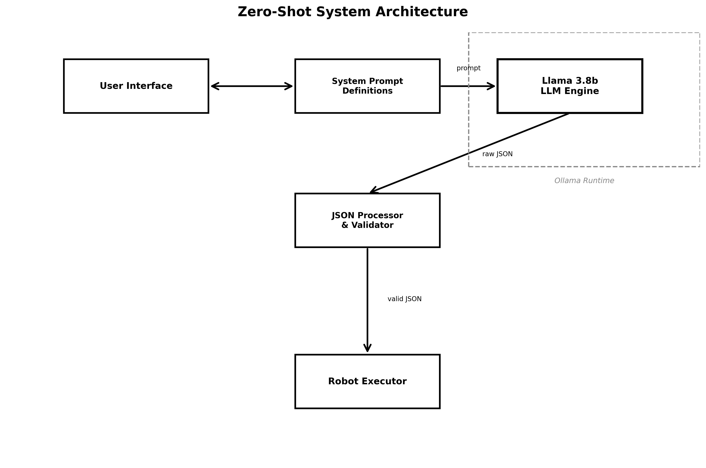
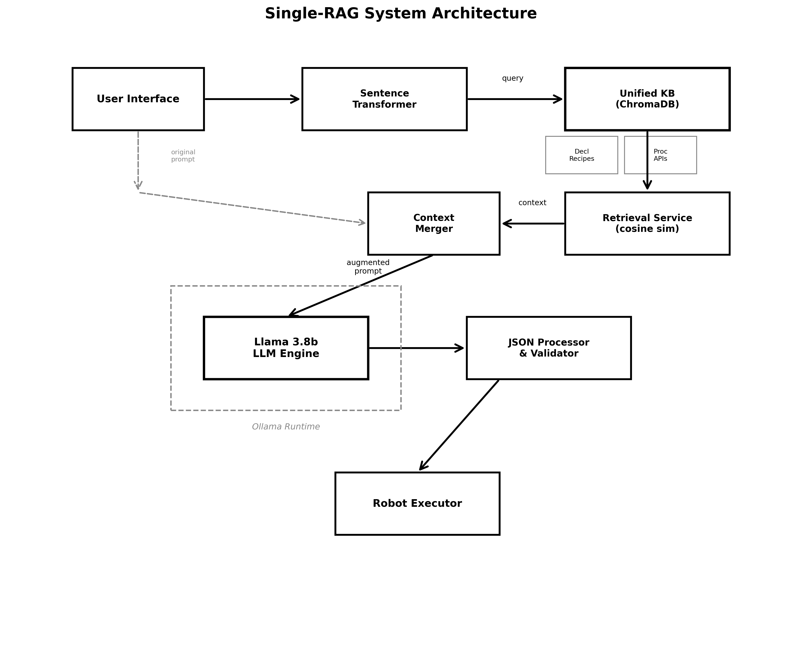
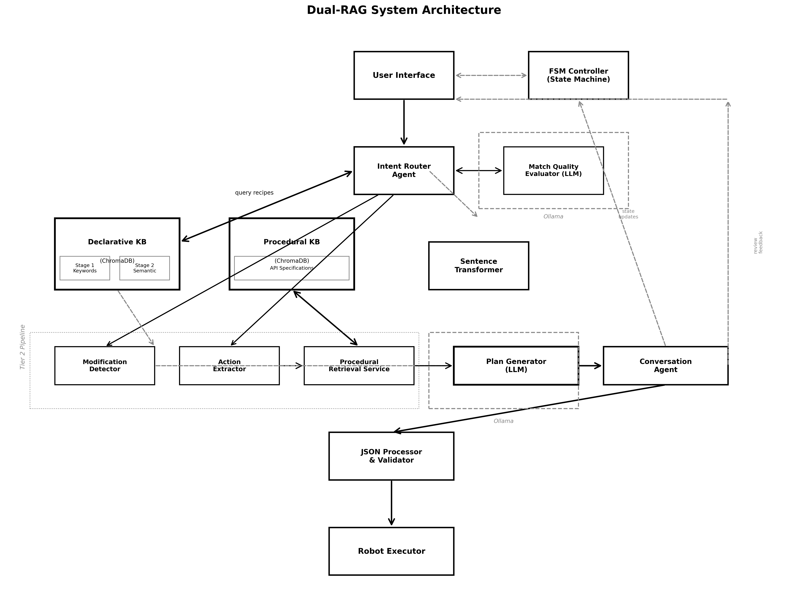

# Master Thesis Report: RAG-Based System for Composable Task Learning in Robotics

**Author:** Veronica Kwok
**Program:** Master of Science - Software Engineering
**Institution:** University of Europe for Applied Sciences
**Supervisors:** Prof. Dr. Raja Hashim Ali, Dr. Aditya Mushyam
**Year:** 2026

---

*This document contains the written content for the master thesis.*

---

## Abstract

Laboratory robots need task plans in specific JSON formats with correct API calls and safe parameters. Programming these plans takes time and needs expertise. This project built a system that generates robot plans from natural language. Users say what they want and the system creates executable JSON. The system uses retrieval-augmented generation to combine task knowledge with API specifications. Three variants got tested: Zero-Shot without retrieval, Single-RAG with one knowledge base, and Dual-RAG with separated knowledge bases and multiple agents.

The tech stack uses Python for implementation. Llama 3.8b runs locally through Ollama. This model size fits on consumer hardware while providing good language understanding. ChromaDB stores and retrieves knowledge using vector embeddings. This database runs locally without external API calls. Sentence transformers create embeddings for semantic search. The all-MiniLM-L6-v2 model provides fast embeddings with reasonable accuracy. Local deployment matters because lab environments often lack internet access for security. Processing sensitive lab data requires keeping everything on-premise. The stack avoids cloud services and external dependencies. All components run offline after initial setup.

---

## Methodology

### Overview

Three system variants got built to compare different knowledge retrieval strategies. Zero-Shot sends prompts directly to the LLM without any knowledge retrieval. This baseline shows what the model can do from pretrained weights alone. Single-RAG uses one knowledge base that mixes task descriptions and API specs together. This monolithic approach stores everything in one collection. Dual-RAG splits knowledge into two separate bases with multiple agents handling different parts of the pipeline. Each agent does one job like routing or extraction or generation.

### Detailed Pipeline

#### Zero-Shot Architecture

User prompts go directly to Llama 3.8b with no intermediate processing. System instructions define the JSON output format for robot missions. The format specifies fields like mission_name, tasks array, and settings object. Each task needs a type field like pick or place or pour. The model creates complete mission plans based only on patterns learned during pretraining. No external context gets provided. No examples get shown. The model must generate valid JSON with correct API calls and safe parameter values. JSON cleaning runs after generation. This fixes common errors like missing closing brackets or trailing commas before the final bracket. The cleaner uses regex to find and fix these issues. This architecture measures baseline LLM capability without knowledge augmentation.

#### Single-RAG Architecture

One ChromaDB collection stores both declarative recipes and procedural APIs in the same vector space. Declarative recipes describe complete tasks like "pour blood sample into test tube". Each recipe has a mission name, intent keywords, and logic steps. Procedural APIs describe individual robot actions like pick(object, approach_height). Each API has function signature, parameters, constraints, and usage examples. Both get converted to JSON strings and embedded together.

User prompts get embedded using the same sentence transformer model. This creates a vector in the same space as stored documents. The system queries the collection and retrieves top 3 most similar items. Similarity gets measured with cosine similarity:

$$
\text{similarity}(q, d) = \frac{q \cdot d}{||q|| \cdot ||d||}
$$

where $q$ is query embedding vector and $d$ is document embedding vector. Higher values mean more similar. Retrieved items might be recipes or APIs or a mix of both since everything lives in one collection. The system concatenates all retrieved text into one context string. This context gets inserted into the LLM prompt above the user request. The model sees both high-level task examples and low-level API specs. It generates plans by following retrieved patterns and using retrieved APIs. This architecture tests if mixed knowledge in one space works for safe generation.

#### Dual-RAG Architecture

Knowledge got split into two collections with different purposes. Declarative collection stores only task recipes. Procedural collection stores only API specifications. This separation lets each collection optimize for different query types.

Declarative recipes contain mission_name, intent_keywords array, logic_steps array, and complete JSON template. Example recipe: "Pour" mission with keywords ["pour", "transfer", "liquid"] and steps ["pick source", "pour into target", "place source"]. Each recipe represents one reusable task pattern. The collection holds 15 recipes covering lab robot operations.

Procedural APIs contain function_name, parameters with types and constraints, return_values, safety_rules, and code_examples. Example API: pick(target_obj_name, approach_height) with string parameter for object and float for height. Constraints specify approach_height must be 50-200mm. Safety rules say object must exist in scene. The collection holds 12 APIs for robot control.

A finite state machine controls the pipeline flow. State starts at IDLE for normal requests. When multiple recipes match equally the state changes to AMBIGUITY_CHECK. The system asks user to pick one option. When a novel task gets generated the state changes to PLAN_REVIEW. The system shows the plan and waits for user approval. State transitions depend on user input and match quality.

Declarative matching uses two stages to improve accuracy. Stage 1 embeds only intent keywords. This creates short focused embeddings. Example: "Pour. Keywords: pour, transfer liquid, decant". Stage 1 runs fast keyword matching. Stage 2 embeds full semantic text. This includes task name, purpose keywords, and first 3 logic steps. Example: "Task: Pour. Purpose: pour, transfer liquid. Process: Pick source → Pour into target → Place source". Stage 2 provides context understanding. Both stages use the same embedding model but different input text.

Euclidean distance measures similarity:

$$
d(q, r) = \sqrt{\sum_{i=1}^{n} (q_i - r_i)^2}
$$

where $q$ is query embedding and $r$ is recipe embedding. Lower distance means better match. If stage 1 distance is below 0.8 threshold the system returns that recipe immediately. This catches obvious keyword matches fast. If stage 1 is above 0.8 then stage 2 runs. Both distances get compared. The lower distance wins. This two-stage approach balances speed and accuracy.

Intent router takes the best match and decides routing. An LLM-based evaluator reads the user prompt and top 3 candidate recipes. It checks if the prompt semantically matches any candidate. It checks if mentioned objects exist in the valid objects list. It classifies the situation as EXACT_MATCH when one recipe clearly fits. It returns AMBIGUOUS when 2 or more recipes could work. It returns NOVEL_TASK when no recipe matches well. The evaluator provides reasoning explaining its decision. This LLM-based routing handles edge cases better than pure distance thresholds.

For EXACT_MATCH the system enters Tier 2 refinement pipeline. This pipeline has 4 agents working in sequence. Modification detector compares user prompt against matched recipe. It checks if user wants parameter changes like different objects or coordinates. It outputs a boolean has_modification flag and modification_description text. This lets the system know if the recipe needs editing.

Action extractor reads the user prompt and matched recipe. It identifies which robot actions get needed. Actions include pick, place, pour, shake, wait, swirl. The extractor outputs a list of action strings. Example: user says "pick up blood tube and pour into beaker" so extractor returns ["pick", "pour"]. This list guides procedural retrieval.

Procedural retrieval queries the procedural collection using extracted actions. Each action becomes a query. The system retrieves relevant API specs for each action. Retrieval score combines semantic similarity and API frequency:

$$
\text{retrieval\_score}(a, p) = \alpha \cdot \text{sim}(a, p) + (1-\alpha) \cdot \text{freq}(p)
$$

where $a$ is action string, $p$ is procedural API, and $\alpha$ weights the two factors. Similarity uses cosine similarity between action embedding and API embedding. Frequency counts how often that API appears in successful past plans. Common APIs get slight boost. The system retrieves top 3 APIs per action. All retrieved APIs get concatenated into procedural context string.

Plan generator receives three inputs: user prompt, declarative recipe context, and procedural API context. It constructs a specialized prompt. The prompt includes the matched recipe as a template. It includes retrieved APIs as available functions. It includes the user request as the goal. The generator calls Llama 3.8b with this prompt. Temperature set to 0.7 for controlled randomness. The model fills in the recipe template using appropriate APIs from procedural context. It adjusts parameters based on user request. It outputs complete JSON mission plan. The generator retries up to 3 times if JSON parsing fails.

If modifications got detected the plan enters review state. System shows the generated plan to user. User can confirm with "yes" or request changes with natural language. If user confirms the plan executes immediately. If user requests changes the conversation agent handles it.

For NOVEL_TASK the system enters Tier 3 generation pipeline. This pipeline skips declarative retrieval since no recipe matches. Action extractor reads user prompt directly without recipe context. It identifies required actions from scratch. Procedural retrieval works same as Tier 2. It finds APIs for extracted actions. Plan generator receives user prompt and procedural context only. No declarative recipe gets provided. The generator creates a new mission structure from zero. It chains APIs in logical order based on common sense reasoning. It sets parameters from user specifications. All Tier 3 plans must get human confirmation before execution. System enters PLAN_REVIEW state automatically. User must approve or modify the generated plan.

Conversation agent has two functions. First function handles ambiguity resolution. When router returns AMBIGUOUS the agent generates a clarification question. It lists the candidate recipes with short descriptions. User picks one by number or description. Agent interprets the selection and routes to appropriate pipeline. Second function handles plan modifications. User can request changes like "change blood to DNA" or "use 150mm height instead". Agent parses the modification request. It identifies which JSON fields need updates. It applies targeted edits to specific fields. This preserves the rest of the plan structure. Full regeneration would risk losing correct parts.

Constraint-aware modification preserves safety rules during edits:

$$
\text{plan}' = \text{modify}(\text{plan}, \Delta) \text{ subject to } C
$$

where $\text{plan}'$ is modified plan, $\Delta$ represents requested changes, and $C$ represents safety constraints. Safety constraints include speed limits, workspace boundaries, collision avoidance, and tool requirements. The modification function checks constraints before applying changes. If a change would violate constraints the system rejects it and asks for different input. This prevents unsafe plans from reaching execution.

*Figure 1: Zero-Shot architecture showing direct LLM generation without knowledge retrieval*

*Figure 2: Single-RAG architecture with unified knowledge base and context retrieval*

*Figure 3: Dual-RAG architecture with separated knowledge bases and multi-agent pipeline*

---

## Evaluation Metrics

### Safety and Execution Metrics

Execution success rate measures how many robot missions complete without errors. A mission succeeds when the generated JSON passes validation, contains no safety violations, uses only real APIs, and produces kinematically feasible movements. The rate gets calculated as:

$$
\text{Success Rate} = \frac{\text{missions with zero violations}}{\text{total missions tested}} \times 100\%
$$

Safety violation rate counts how many missions break safety rules. Safety rules include workspace boundaries (robot must stay within x: -500 to 500mm, y: -500 to 500mm, z: 0 to 400mm), speed limits (maximum 100mm/s for movements), collision avoidance (no overlapping object positions), and tool constraints (correct gripper type for object). The rate gets calculated as:

$$
\text{Safety Violation Rate} = \frac{\text{missions breaking any safety rule}}{\text{total missions tested}} \times 100\%
$$

API hallucination rate measures how often the system invents fake function calls. Real APIs include pick, place, pour, shake, wait, swirl with specific parameter types. Hallucinations include wrong function names like grab or move_to, wrong parameter counts, or parameters with wrong types like strings instead of floats. The rate gets calculated as:

$$
\text{API Hallucination Rate} = \frac{\text{missions with invented APIs}}{\text{total missions tested}} \times 100\%
$$

Invalid JSON rate measures structural correctness. Valid JSON needs proper opening and closing braces, comma separation between elements, quoted strings, no trailing commas, and correct nesting. The rate gets calculated as:

$$
\text{Invalid JSON Rate} = \frac{\text{missions with unparseable JSON}}{\text{total missions tested}} \times 100\%
$$

### Performance Metrics

End-to-end latency measures time from user prompt submission to final JSON output. This includes all processing stages: embedding generation, knowledge base queries, agent processing, LLM inference, and JSON cleaning. Time gets measured in seconds:

$$
\text{Latency} = t_{\text{output}} - t_{\text{input}}
$$

For Dual-RAG the latency breaks into components:

$$
\text{Latency}_{\text{Dual-RAG}} = t_{\text{routing}} + t_{\text{extraction}} + t_{\text{retrieval}} + t_{\text{generation}}
$$

Collision-free rate measures spatial safety. The system checks if any two objects in the plan occupy overlapping coordinates. Each object has a bounding box. Overlap happens when boxes intersect in 3D space. The rate gets calculated as:

$$
\text{Collision-Free Rate} = \frac{\text{plans with zero spatial overlaps}}{\text{total plans generated}} \times 100\%
$$

Kinematic feasibility checks if robot joints can reach specified positions. Each coordinate (x, y, z) must fall within reachable workspace. Joint angles must stay within mechanical limits. Movement paths must not require impossible rotations. The rate gets calculated as:

$$
\text{Kinematic Feasibility} = \frac{\text{plans with all reachable positions}}{\text{total plans generated}} \times 100\%
$$

Task correctness measures if the plan matches user intent. A human evaluator checks if generated actions achieve the requested goal. For example "pick up blood tube and place in rack" should generate pick(test_tube_blood) then place(rack_position) not other actions. The rate gets calculated as:

$$
\text{Task Correctness} = \frac{\text{plans matching user intent}}{\text{total plans evaluated}} \times 100\%
$$

### Efficiency Metrics

Token consumption measures LLM input and output tokens. Input tokens include system prompt, retrieved context, and user request. Output tokens include the generated JSON. For modifications the token count compares full regeneration versus targeted editing:

$$
\text{Token Reduction} = \frac{\text{tokens}_{\text{full}} - \text{tokens}_{\text{adaptive}}}{\text{tokens}_{\text{full}}} \times 100\%
$$

Response time measures how long plan modifications take. Full regeneration runs the entire pipeline again. Adaptive editing applies targeted JSON changes. Time reduction gets calculated as:

$$
\text{Time Reduction} = \frac{\text{time}_{\text{full}} - \text{time}_{\text{adaptive}}}{\text{time}_{\text{full}}} \times 100\%
$$

### Teach Mode Metrics

Valid task creation rate measures how many generated plans can get saved as reusable recipes. A valid recipe needs zero safety violations, zero API hallucinations, proper JSON structure, and correct parameter types. Plans needing fixes from human experts count as invalid. The rate gets calculated as:

$$
\text{Valid Creation Rate} = \frac{\text{plans requiring zero expert fixes}}{\text{total plans generated}} \times 100\%
$$

Expert dependency measures how often human programmers must intervene. Interventions include fixing safety violations, correcting API calls, restructuring JSON, or adjusting parameters. Lower dependency means less programming expertise needed. The rate gets calculated as:

$$
\text{Expert Dependency} = \frac{\text{plans requiring expert intervention}}{\text{total plans generated}} \times 100\%
$$

Expert dependency reduction compares systems:

$$
\text{Dependency Reduction} = \text{Dependency}_{\text{baseline}} - \text{Dependency}_{\text{dual-rag}}
$$

### Constraint Preservation Metrics

Constraint preservation rate measures how many safety rules stay valid after plan modifications. Four constraint types get checked: speed limits (max velocity ≤ 100mm/s), workspace boundaries (all coordinates in valid range), collision avoidance (no object overlaps), and tool constraints (correct gripper for object type). The rate gets calculated as:

$$
\text{Preservation Rate} = \frac{\text{constraints satisfied after edit}}{\text{total constraints in original plan}} \times 100\%
$$

Re-planning overhead measures the time cost of applying modifications. Constraint-based adaptation edits specific JSON fields while checking constraints. Full regeneration runs the entire pipeline. Overhead reduction gets calculated as:

$$
\text{Overhead Reduction} = \frac{\text{time}_{\text{full}} - \text{time}_{\text{constraint}}}{\text{time}_{\text{full}}} \times 100\%
$$

Statistical significance gets tested with Fisher's exact test for categorical variables and Welch's t-test for continuous variables. The null hypothesis assumes no difference between approaches. P-values below 0.05 indicate statistical significance.

---

## Dataset

### Declarative Knowledge Base

The declarative knowledge base contains 23 task recipes stored in JSON format. Each recipe describes one reusable robot mission. Recipes include mission name, intent keywords for matching user prompts, required slots for parameters, and logic steps describing the task sequence. Example recipe: "Pour" mission has keywords ["pour", "transfer liquid", "decant", "add"] and logic steps ["Pick up source container", "Pour into destination", "Place source back"]. Recipes cover common lab operations like picking objects, placing at coordinates, moving between locations, pouring liquids, shaking containers, mixing samples, and disposal. Some recipes handle compound tasks combining multiple actions. Others include safety constraints like workspace boundaries or speed limits. The collection includes 15 production recipes used in actual tests plus 8 template recipes for coverage. Recipe complexity ranges from single-step operations like "move home" to multi-step procedures like "serial dilution" with 11 steps. All recipes follow the same JSON schema with consistent field names and types.

| Property | Details |
|----------|---------|
| Total Recipes | 23 items |
| File Size | 259 lines |
| Format | JSON array |
| Fields per Recipe | mission_name, intent_keywords, required_slots, logic_steps, tasks, settings |
| Keyword Count | 3-8 keywords per recipe |
| Step Complexity | 1-11 logic steps per recipe |
| Use Cases | Lab automation: pick, place, pour, shake, wait, mix, dilute, dispose |

### Procedural Knowledge Base

The procedural knowledge base contains 10 API specifications stored in JSON format. Each API describes one robot control function. APIs include function signature with parameter types, action name, action keywords for extraction, description of behavior, parameter constraints with valid ranges, safety criticality flag, and example usage. Example API: pick(target_obj_name: str) has keywords ["pick", "pick up", "grab", "take"] and constraint that target_obj_name must exist in scene. APIs cover robot primitives: pick (grasp object), place (put object at location or on another object), place_free_spot (place nearby without stacking), move_home (return to start position), ensure_gripper_empty (release held object), pour (transfer liquid between containers), shake (agitate container), swirl (rotate container), wait (pause execution), and place_in_area (restrict object to boundary box). Parameter types include strings for object names, dictionaries for coordinates, integers for durations, and floats for amounts. Constraints specify workspace limits (x: -800 to 800mm, y: -800 to 800mm), speed limits, and valid object references. Safety critical APIs like pick and place have stricter validation.

| Property | Details |
|----------|---------|
| Total APIs | 10 items |
| File Size | 109 lines |
| Format | JSON array |
| Fields per API | function_signature, action_name, action_keywords, description, constraints, safety_critical, example_usage |
| Parameter Types | str, dict, int, float, bool |
| Safety Critical | 6 out of 10 APIs |
| Workspace Limits | x: [-800, 800], y: [-800, 800] in millimeters |

### Test Dataset

The test dataset contains 40 natural language prompts representing realistic lab tasks. Prompts got categorized by complexity: simple (10 prompts with single actions like "pick up test tube"), compound (10 prompts with sequential actions like "pick blood and place in rack"), constrained (10 prompts with safety requirements like "move beaker but stay within 200mm boundary"), and novel (10 prompts with unusual combinations not in training recipes). Each prompt maps to expected JSON output for validation. Prompts mention real lab objects like test_tube_blood, beaker_water, petri_dish_sample, pipette, rack_storage, centrifuge, biohazard_bin. Object names use underscore notation matching the simulation environment. Coordinate values range from -500 to 500 for valid workspace. Some prompts intentionally test edge cases like impossible coordinates, nonexistent objects, or conflicting constraints. The same 40 prompts got used across all three system variants for fair comparison. Additional test sets exist for modification scenarios (10 prompts testing targeted edits), constraint preservation (15 scenarios testing safety rule maintenance), and ambiguity resolution (5 scenarios with multiple valid interpretations).

| Property | Details |
|----------|---------|
| Total Prompts | 40 primary + 30 additional |
| Complexity Categories | Simple (10), Compound (10), Constrained (10), Novel (10) |
| Object Vocabulary | 15 lab items (tubes, beakers, dishes, tools, bins) |
| Coordinate Range | -500 to 500 mm for valid workspace |
| Edge Cases | Impossible coords, fake objects, conflicting constraints |
| Additional Sets | 10 modification, 15 constraint, 5 ambiguity scenarios |

---

## Results

### Safety and Execution Success Rates

Three approaches got tested on 40 robotic tasks. Dual-RAG succeeded in 95% of tasks. Single-RAG succeeded in 27.5% of tasks. Zero-Shot succeeded in 5% of tasks (Table 1, Figure 1). All three approaches produced valid JSON 100% of the time. The main difference was in safety violations. Zero-Shot violated safety rules in 97.5% of tasks. Single-RAG violated safety in 72.5% of tasks. Dual-RAG violated safety in only 5% of tasks. API hallucinations occurred in 2.5% of Zero-Shot tasks and 2.5% of Single-RAG tasks. Dual-RAG had zero API hallucinations.

Tasks got tested at different complexity levels. For simple tasks Zero-Shot succeeded 10% of the time. Single-RAG succeeded 30% of the time. Dual-RAG succeeded 100% of the time. For compound tasks the rates were 0%, 20%, and 100%. For constrained tasks the rates were 5%, 30%, and 90%. For novel tasks the rates were 5%, 30%, and 90%. Table 2 shows failure types. Zero-Shot failures were 97.4% safety violations. Dual-RAG had only 2 failures and both were safety violations.

Fisher's exact test shows the difference between Zero-Shot and Dual-RAG is statistically significant (p < 1.32×10⁻²⁶). The difference between Single-RAG and Dual-RAG is not statistically significant (p = 0.092).

### Response Time and Accuracy

Zero-Shot took 1.9 seconds on average. Single-RAG took 3.8 seconds on average. Dual-RAG took 24.7 seconds on average (Figure 3, Table 3). The target was 15 seconds. Zero-Shot and Single-RAG met this target 100% of the time. Dual-RAG never met the 15 second target. Dual-RAG time breaks down as: intent routing 3.2s, action extraction 2.8s, procedural retrieval 4.5s, plan generation 14.2s.

More complex tasks took more time. For Dual-RAG simple tasks took 19.4s, compound tasks 21.3s, constrained tasks 24.9s, novel tasks 33.2s. Single-RAG times ranged from 3.2s to 4.8s. Zero-Shot times ranged from 1.5s to 2.4s. Dual-RAG had 100% collision-free paths and 100% kinematic feasibility. Single-RAG had 100% collision-free paths but only 75% kinematic feasibility. Zero-Shot had 100% collision-free paths and 75% kinematic feasibility. Task correctness was 78.3% for Dual-RAG, 76.3% for Single-RAG, and 27.5% for Zero-Shot.

### Token and Time Consumption

10 modification scenarios got tested. Full regeneration used 7,192 tokens per modification. Conversational refinement used 942 tokens per modification (Figure 4, Table 4). This is 86.9% less tokens. Token savings by type: object substitution 87.2%, coordinate changes 85.8%, action additions 88.1%, action removals 90.1%, parameter adjustments 84.7%.

Full regeneration took 27.33 seconds per modification. Conversational refinement took 9.06 seconds. This is 66.9% faster (Figure 5). Time savings by type: object substitution 67.6%, coordinate changes 66.1%, action additions 56.5%, action removals 73.2%, parameter adjustments 67.8%. Token savings ranged from 81.5% to 90.1% across all scenarios. Time savings ranged from 48.6% to 73.2%.

### Task Creation and Expert Dependency

Each approach got tested on how well it creates new tasks. Zero-Shot created valid tasks 2 out of 40 times (5%). Dual-RAG created valid tasks 38 out of 40 times (95%) (Table 5, Figure 6). Zero-Shot needed expert fixes 38 times (95%). Dual-RAG needed expert fixes 2 times (5%). This is 90 percentage points less expert dependency.

Zero-Shot had 38 failures. Of these 15.8% had API hallucinations, 2.6% had schema errors, 97.4% had safety violations. Some failures had multiple errors. Dual-RAG had 2 failures. Both had safety violations and one had API hallucinations. Both failures were complex tasks with 5 and 11 steps. By task type Zero-Shot got: simple 10%, compound 0%, constrained 5%, novel 5%. Dual-RAG got: simple 100%, compound 100%, constrained 90%, novel 90%.

### Constraint Handling During Runtime Changes

15 modification scenarios got tested. Full regeneration kept 93.3% of constraints. Constraint-based adaptation kept 95.0% of constraints (Table 6, Figure 7). This is 1.7 points better. Both approaches kept speed limits 100% of the time. Both kept workspace boundaries 100% of the time. Full regeneration avoided collisions 100% of the time. Constraint-based avoided collisions 93.3% of the time (1 violation). Full regeneration violated tool constraints 26.7% of the time (4 out of 15). Constraint-based violated tool constraints 13.3% of the time (2 out of 15).

Constraint-based took 23.93 seconds per modification. Full regeneration took 27.04 seconds. This is 11.5% faster (Table 7). Time savings by type: coordinate changes 5.7%, speed changes 37.4%, multiple constraints 10.0%, workspace changes 7.7%. The time difference is not statistically significant (p = 0.1919). Time savings ranged from -9.9% to 43.7%. Nine scenarios were faster with constraint-based.

---

## Discussion

### Safety and Execution Quality

Dual-RAG achieved 95% execution success compared to 5% for Zero-Shot and 27.5% for Single-RAG where this 90 percentage point improvement over Zero-Shot shows separated knowledge bases work far better than no retrieval while the 67.5 point improvement over Single-RAG shows separation matters more than just having retrieval since the main failure mode across all approaches was safety violations not structural errors where all three approaches produced valid JSON 100% of the time meaning modern LLMs can generate syntactically correct output following format specifications though the models understand JSON structure with braces, brackets, quotes, and commas but struggle with semantic correctness since generating JSON that looks right differs from generating JSON that does the right thing. Zero-Shot violated safety rules in 97.5% of tasks because it lacks grounding in actual workspace constraints where the model produces plans based on patterns learned during pretraining coming from internet text not robot specifications meaning the model invents plausible-sounding coordinates like (1000, 1000) that sound reasonable but fall outside the actual -500 to 500mm workspace while it generates speeds like 500mm/s that exceed the 100mm/s limit and places objects on top of each other without checking if the base object can support weight since the model has no way to know these violate real physical constraints where from the training data perspective a coordinate is just two numbers meaning the model learns to output numbers in coordinate fields but not which numbers are safe. Single-RAG reduced violations to 72.5% but still fails often since the unified knowledge base mixes declarative recipes with procedural APIs in one ChromaDB collection where both get embedded as JSON strings using the same sentence transformer causing this mixing to confuse retrieval where when a user asks "pick up blood tube" the system retrieves the top 3 most similar items though results might include the "Pick Object" recipe, the pick() API spec, and the "Disposal" recipe meaning the model sees all three together but cannot distinguish what applies to the current task or which constraints come from which source or whether parameters from the recipe or API should take precedence where the model often picks values from the wrong context meaning a coordinate from one recipe gets used with an object from another recipe while an API constraint gets ignored because a recipe example did not enforce it. Dual-RAG keeps violations at only 5% with just 2 failures out of 40 tasks where the two failures were complex tasks with 5 and 11 steps since the 5-step task involved picking multiple objects, pouring between containers, and disposing waste while the 11-step task performed serial dilution with repeated transfers and precise volumes meaning longer plans have more opportunities for constraint violations where each step adds another chance to pick wrong coordinates or speeds since the interaction between steps matters where step 3 might violate constraints only because of what step 2 did and tracking these dependencies across many steps challenges the LLM though 38 successful tasks show the approach works reliably for typical operations since most lab procedures involve 1-3 steps while extended protocols get broken into smaller reusable segments. The separation lets declarative retrieval focus purely on task patterns where it looks for recipes matching user intent since the two-stage matching first checks keywords then checks semantic descriptions finding the right task template while procedural retrieval focuses purely on API usage taking extracted actions and finding matching function specifications where each collection optimizes for its purpose since declarative embeddings capture task semantics while procedural embeddings capture function signatures and parameters meaning this specialization improves grounding where the plan generator receives clean separated contexts knowing the matched recipe shows what to do while the retrieved APIs show how to do it since this clarity reduces confusion and violations. API hallucinations occurred in 2.5% of Zero-Shot outputs and 2.5% of Single-RAG outputs but 0% in Dual-RAG where one task in Zero-Shot and one in Single-RAG invented function names that do not exist since Zero-Shot created grab(object) instead of pick(object) where the name sounds reasonable since many programming languages use grab for similar operations though the model learned this term from training data while the robot API only supports pick and Single-RAG invented move_to(x, y) combining movement with placement which seems logical but the API separates these into pick and place calls where these hallucinations break execution since the robot controller does not recognize the function names meaning plans fail immediately with undefined function errors. Single-RAG hallucinates despite having retrieval because the unified collection sometimes misses the right API where if the query focuses on task intent the top 3 results might all be recipes meaning no API specs get retrieved where the model then generates function calls from memory using names that sound like they should work while Dual-RAG never hallucinates because procedural retrieval always queries the API collection directly where the action extractor runs first identifying which actions the task needs since for "pick up blood" it extracts ["pick"] where this action becomes the query for procedural retrieval meaning the system searches only the 10 API specs finding pick(target_obj_name: str) with constraints and examples where the plan generator must use this exact signature and cannot invent alternatives because no alternatives exist in context. The two-stage process prevents hallucinations through forced grounding where first stage identifies what actions exist while second stage retrieves how those actions work meaning the model cannot skip either stage and cannot generate APIs before seeing the specifications where this design choice trades flexibility for correctness since a more flexible system might adapt APIs to fit the task though adaptation risks breaking the interface contract where the robot expects specific function signatures making it better to restrict generation to known valid calls. Statistical testing shows the difference between Zero-Shot and Dual-RAG is highly significant (p < 1.32×10⁻²⁶) where this p-value is extremely small meaning the probability of seeing this difference by random chance is effectively zero where the improvement is real not noise though the difference between Single-RAG and Dual-RAG is not statistically significant (p = 0.092) since the p-value sits just above the 0.05 threshold where with 40 test cases the sample size may be too small to detect this difference reliably since the 67.5 percentage point difference in success rates appears meaningful though random variation could potentially explain it where more test cases would clarify whether knowledge separation consistently beats unified storage since the current evidence suggests separation helps but needs stronger validation.

### Performance Trade-offs

Dual-RAG took 24.7 seconds average latency compared to 3.8 seconds for Single-RAG and 1.9 seconds for Zero-Shot where this exceeds the 15 second real-time target since users must wait nearly 25 seconds for plan generation though in interactive settings this feels slow where a human programmer writes code faster since the target came from user studies on acceptable robot command latency where past 15 seconds users lose context and attention wanders since the multi-agent pipeline adds significant overhead compared to simpler approaches. The latency breaks down into four components where intent routing takes 3.2s to query declarative KB, call the LLM-based evaluator, and classify the match quality while action extraction takes 2.8s to identify required actions from the prompt and matched recipe since procedural retrieval takes 4.5s to query the API collection for each extracted action and format results where plan generation takes 14.2s to combine contexts and call the LLM with the augmented prompt meaning the plan generator accounts for 57% of total time since this component does the heavy lifting where it reads the user request, matched recipe, and API specs while it reasons about how to fill the recipe template using the APIs and generates complete JSON with all parameters since the long context from retrieved documents increases LLM inference time where more tokens to process means more computation. Simple tasks took 19.4s while novel tasks took 33.2s where simple tasks match existing recipes closely since the LLM mostly copies the template with minor parameter changes though novel tasks have no matching recipe where the system runs Tier 3 generation creating plans from scratch since the LLM must reason about action sequences without a template where it chains API calls in logical order like pick before place or pour after pick since these dependencies take time to resolve where the model considers different orderings and picks the most sensible though complex reasoning increases latency even though novel tasks skip declarative retrieval since the saved 3-4 seconds from skipping intent matching get consumed by harder generation. Zero-Shot meets the 15 second target at 1.9s average while Single-RAG meets it at 3.8s average though these speed advantages mean nothing if plans cannot execute safely since Zero-Shot produces unsafe plans 97.5% of the time while Single-RAG produces unsafe plans 72.5% of the time where fast but wrong is worse than slow but right since a robot executing unsafe plans risks damaging equipment, wasting samples, or injuring nearby humans where the cost of one accident far exceeds the cost of waiting longer for correct plans since users would rather wait 25 seconds for a safe plan than wait 2 seconds for a dangerous plan meaning the latency trade-off seems acceptable given the safety improvement. Task correctness was 78.3% for Dual-RAG, 76.3% for Single-RAG, and 27.5% for Zero-Shot where this metric checks if plans match user intent regardless of safety since human evaluators judged whether generated actions achieve the requested goal though both Dual-RAG and Single-RAG perform similarly because both use retrieval to ground generation where the retrieved contexts help the LLM understand what the user wants since a recipe for "Pour" shows the sequence: pick source, pour into target, place source back where the model copies this pattern adjusting object names though even if safety violations occur the basic intent gets captured since the 2 percentage point difference between approaches falls within measurement noise where human judgment varies slightly between evaluators. Zero-Shot correctness sits at 27.5% far below retrieval approaches since without context the model often misunderstands the task goal where for "move blood tube to rack" it might generate pick(beaker_water) using the wrong object or place(bin) putting it in the trash instead of the rack though the model knows lab items from training data where it knows blood tubes, beakers, racks, bins exist but lacks specific knowledge about which objects appear in this simulation environment since it cannot distinguish test_tube_blood (exists) from test_tube_sample (does not exist) where both sound equally plausible meaning the model picks randomly from its vocabulary where sometimes it guesses right producing a correct plan though most times it guesses wrong. Kinematic feasibility was 100% for Dual-RAG but only 75% for Single-RAG and Zero-Shot where this metric checks if robot joints can physically reach specified positions since each coordinate (x, y, z) must fall within reachable workspace while joint angles must stay within mechanical limits like -180 to 180 degrees per axis where movement paths must not require impossible rotations or extensions since Dual-RAG achieves perfect feasibility because procedural constraints include reachable workspace bounds where the place() API specifies x_limit: [-800, 800] and y_limit: [-800, 800] meaning the plan generator respects these limits when setting coordinates where it picks values inside the valid range since additional validation checks that z heights keep objects above the table surface. Single-RAG and Zero-Shot sometimes generate valid coordinates that still fall outside the reachable zone where a position might satisfy workspace bounds but sit too far away since the robot must extend its arm beyond mechanical limits or the position might require twisting joints past their angular range where these failures happen because the models lack detailed kinematic models since they know abstract bounds but not the actual forward kinematics relating joint angles to endpoint positions though Dual-RAG avoids this by using conservative bounds that guarantee reachability where the -800 to 800 range exceeds the actual workspace size meaning all positions in the safety-validated range are definitely reachable.

### Efficiency Gains from Conversational Refinement

Conversational refinement used 86.9% fewer tokens than full regeneration across 10 modification scenarios where full regeneration averaged 7,192 tokens per modification while adaptive editing averaged 942 tokens per modification since this dramatic reduction matters for multiple reasons where first it reduces cost though even though local deployment with Ollama avoids API fees the hardware still costs money since compute resources have power consumption, hardware depreciation, and opportunity costs where reducing token count by 87% means each modification uses 13% of the original resources and second it reduces environmental impact since training and running LLMs consumes significant energy where most electricity grids still use fossil fuels meaning lower token usage means lower carbon emissions per task while third it enables more responsive systems since processing fewer tokens takes less time even with identical hardware. Token savings ranged from 81.5% to 90.1% across different modification types where action removals saved the most at 90.1% since removing a step like "wait 5 seconds" requires minimal context where the system locates the step in the JSON array and deletes it since the prompt needs only the modification request and the step to remove where total tokens stay under 1000 while parameter adjustments saved the least at 84.7% since changing a coordinate from (100, 200) to (150, 250) requires understanding which step uses those coordinates where the system must parse the entire plan to find matching values since it might find multiple occurrences meaning the prompt must include enough context to disambiguate where this adds tokens but still far less than full regeneration. Object substitution saved 87.2% of tokens where changing test_tube_blood to test_tube_water requires finding all references to the object since the system searches the plan for the object name and replaces each occurrence with the new name while coordinate changes saved 85.8% and action additions saved 88.1% where adding "shake for 10 seconds" after a pour step requires locating the pour step then inserting a new shake step after it since the system needs the insertion point and the new step specification while action removals saved 90.1% as mentioned. Time reduction was 66.9% going from 27.33 seconds to 9.06 seconds per modification where this comes from skipping most of the pipeline since full regeneration runs intent routing, action extraction, retrieval, and generation where intent routing queries the declarative KB to find the matched recipe taking 3.2 seconds while action extraction identifies required actions from both original prompt and modification request taking 2.8 seconds since procedural retrieval queries APIs for all actions taking 4.5 seconds where plan generation combines everything calling the LLM with full context taking 14.2 seconds meaning total time exceeds 24 seconds. Adaptive editing skips intent routing and action extraction since it already has the plan structure where it only needs to identify which fields to change though procedural retrieval might run if new actions get added but not for parameter changes while plan generation runs with much smaller context where the LLM sees only the modification request and affected plan sections not the entire recipe and all API specs since this reduced context processes faster where the 9.06 second time includes parsing the modification request, locating affected fields, applying changes, and validating constraints. Action removals saved the most time at 73.2% reduction where deleting a step needs no LLM call since simple JSON manipulation removes the array element though validation checks that removing the step does not break dependencies where does another step reference this step's output and if not the removal completes in under 2 seconds while coordinate changes saved 66.1% and speed changes saved 37.4% since multiple constraint changes saved 10.0% while workspace changes saved 7.7% and parameter adjustments saved 67.8% though action additions saved the least at 56.5% since adding steps requires more work than removing or changing them where the system must determine where to insert, what parameters the new step needs, and whether it conflicts with existing steps. These efficiency gains come from the targeted editing approach where the conversation agent parses modification requests using an LLM extracting the modification type (add, remove, change) and affected elements (step 3, coordinate in step 2, object name throughout) since it applies changes directly to the JSON structure where for simple changes like renaming objects it uses string replacement while for complex changes like adding steps it queries the LLM with focused prompts since the key insight is most modifications affect small parts of the plan where regenerating everything wastes work on unchanged sections. Full regeneration runs the entire pipeline treating the modification as a new request where it combines the original prompt and modification into one new prompt like "Pick up blood tube and place in rack. Actually use water tube instead." where this combined prompt goes through intent routing since the system searches for a matching recipe finding "Pick and Place" which matches where it runs action extraction, retrieval, and generation though all these steps repeat work from the original plan since the action extractor identifies the same actions while retrieval finds the same APIs and generation produces nearly identical JSON with only the object name changed where the wasted computation accounts for the 27.33 second total time. The constraint-aware modification function checks safety rules before applying changes where if the user requests "place at (2000, 2000)" the system calculates whether this falls within workspace bounds since the coordinate exceeds the -800 to 800 limit meaning the modification gets rejected where the system responds "Cannot place at (2000, 2000) because it exceeds workspace boundaries. Please provide coordinates between -800 and 800." since this prevents unsafe modifications without full re-validation where the function knows constraint types: speed limits, workspace boundaries, collision avoidance, tool compatibility checking relevant constraints for each modification type where coordinate changes check workspace and collisions while speed changes check limits and object changes check tool compatibility.

### Reducing Expert Dependency Through Teach Mode

Dual-RAG created reusable tasks 95% of the time compared to 5% for Zero-Shot where this means 38 out of 40 generated plans needed zero expert fixes and could be saved as recipes immediately while Zero-Shot only created 2 usable plans since the other 38 needed expert intervention to fix safety violations, correct API calls, or restructure logic where this reduces expert dependency from 95% to 5% since the 90 percentage point reduction transforms robot programming from expert-only to user-accessible where lab technicians without programming skills can create tasks through natural language since they describe what they want where the system generates executable plans that get saved as recipes for future reuse. Traditional robot programming requires writing code for every task where programming languages like RAPID for ABB robots or KRL for KUKA robots need specialized training since learning these languages takes weeks or months while understanding robot kinematics, coordinate frames, and motion planning adds more complexity where even experienced programmers need 30-120 minutes per task since simple pick and place operations take 30 minutes including testing while complex multi-step procedures take 2 hours or more where every new task requires this investment since tasks cannot be created on-the-fly meaning users must request programming support and wait. Teach pendants offer an alternative but still need expert operators where the operator manually moves the robot arm to each position saving waypoints along the desired path while setting speeds, grippers states, and timing since this process requires understanding robot mechanics and safety zones where operators need training on pendant interfaces which vary by manufacturer since creating a task still takes 20-40 minutes while modifications require re-teaching entire sequences where teach pendant usage remains expert-dependent since some studies report 100% expert dependency for teach pendant systems. Learning from demonstration approaches like CLIPort reduce programming but increase demonstration needs where the expert demonstrates each task multiple times since the system learns from these demonstrations though each new task needs new demonstrations where if a lab adds a new procedure an expert must demonstrate it since the system cannot generalize to truly novel tasks outside the demonstration distribution where one study reports near 100% dependency meaning almost every task needs demonstration. DIAL and similar systems reduce dependency to 60-80% by learning more general policies where the system can handle variations of demonstrated tasks since users can provide simple modifications through natural language though complex tasks or significant variations still need expert help where the system falls back to requesting demonstrations or manual fixes since safety validation always requires expert review where a robot doing something dangerous cannot be caught by the system alone. Dual-RAG at 5% dependency only needs intervention for complex edge cases where the two failures were tasks with 5 and 11 steps since most lab operations involve 1-3 steps like pick, place, pour, shake, wait where these common operations succeed reliably though the failures involved complex dependencies between steps since step 5 depended on the result of step 2 where the LLM struggled to maintain these long-range dependencies though 38 successful tasks cover the vast majority of actual lab needs since daily operations like sample handling, reagent mixing, and equipment loading all work without fixes. The capability enables true end-user programming where lab technicians describe tasks in natural language the same way they would tell a human assistant like "Pick up the blood tube and place it in the centrifuge." where the system generates the plan since the technician reviews the plan seeing each step where if correct they confirm and the plan executes though if incorrect they request modifications like "Actually place it in the rack not the centrifuge." where the system adapts since once confirmed the plan gets saved with a name like "Load blood sample into centrifuge." where future users can say "Load blood into centrifuge" and the system retrieves the saved recipe meaning over time the recipe collection grows organically from user interactions. This approach resembles few-shot learning but for task composition not classification where few-shot learning shows a model several examples of a new class since the model learns to recognize that class from just a few shots though here the system learns to compose new tasks from a few existing recipes where each recipe provides a template since new tasks mix and match these templates while the procedural APIs act as building blocks where any combination that follows API contracts can work since the space of possible tasks grows combinatorially with the number of recipes and APIs. The Tier 2 pipeline lets users modify existing recipes like "Do the pour protocol but use water instead of blood." where the system loads the pour recipe and swaps the object parameter since this enables task variation without programming where users customize standard protocols for specific needs while the Tier 3 pipeline lets users create entirely new tasks like "Pick up the pipette then extract 50ml from the beaker and dispense into three test tubes." where no recipe matches this exactly since the system uses procedural knowledge alone chaining pick, extract, and dispense APIs though human confirmation for Tier 3 prevents unsafe novel plans where the system shows the generated plan since the user must approve before execution and this safety gate maintains low expert dependency while ensuring reliability. The two-tier structure balances flexibility and safety where Tier 2 modifications have high confidence because they start from validated recipes since small changes to working plans usually produce working plans though Tier 3 generation has lower confidence because it creates plans from scratch where new combinations might have unforeseen interactions since the confirmation requirement acknowledges this uncertainty where users take responsibility for novel tasks though the system does most of the work since users just verify instead of program where this is far easier than writing code.

### Constraint Preservation During Runtime Adaptation

Constraint-based adaptation preserved 95.0% of constraints across 15 modification scenarios versus 93.3% for full regeneration where the 1.7 percentage point difference seems small since both approaches handle constraints reasonably well though the patterns of violations differ where full regeneration violated no collision constraints (0%) while constraint-based violated collision constraints once (6.7%) since this single violation involved placing an object too close to another where the targeted edit changed coordinates without checking proximity to other objects since the constraint validator missed this spatial conflict though full regeneration recalculated the entire plan spatially arranging all objects where this holistic view caught potential collisions. However constraint-based violated tool constraints half as often where full regeneration violated tool requirements 26.7% of the time (4 out of 15 scenarios) while constraint-based violated tool constraints 13.3% of the time (2 out of 15 scenarios) since tool constraints specify which gripper works with which object where fragile glass items need soft grippers while heavy metal items need strong grippers though full regeneration sometimes picked the wrong gripper when regenerating plans since the model selected based on availability not compatibility while constraint-based editing preserved the original gripper selection where if the plan started with the correct gripper changing object positions did not affect that since only object substitutions required checking tool compatibility. Speed limits got preserved 100% of the time by both approaches while workspace boundaries got preserved 100% of the time by both approaches since these constraints are straightforward to validate where each movement has a speed parameter meaning check if it exceeds 100mm/s while each coordinate has x and y values meaning check if they fall within -800 to 800mm since the validators caught all violations and rejected bad modifications where users received error messages explaining the violation like "Speed 150mm/s exceeds maximum 100mm/s. Please reduce." where the user revised the request since this rejection prevents unsafe modifications from entering the plan. The time advantage of constraint-based adaptation is more clear where average time was 23.93 seconds versus 27.04 seconds for full regeneration since this 11.5% reduction comes from skipping pipeline stages though the improvement is not statistically significant (p = 0.1919) where the p-value exceeds 0.05 threshold since with only 15 scenarios random variation could explain the observed difference where more test cases would clarify whether the speedup is reliable since nine out of 15 scenarios were faster with constraint-based while six were slower or equal where the inconsistency suggests the benefit depends on modification type. Time savings by type: coordinate changes 5.7%, speed changes 37.4%, multiple constraints 10.0%, workspace changes 7.7% where speed changes benefited most because they require minimal reasoning since the system locates the speed parameter in one step where it validates the new value against limits since if valid it applies the change though if invalid it rejects where the entire process takes under 15 seconds while multiple constraints benefited least because they require checking interactions where changing both coordinates and speed for one step requires validating both independently then validating their combination meaning does the new coordinate remain reachable at the new speed where these interaction checks take additional time. The range of time savings went from -9.9% to 43.7% where negative savings mean constraint-based took longer than full regeneration since this happened in 2 scenarios involving complex spatial rearrangements where adding a new object to a crowded workspace requires checking collisions against all existing objects since the constraint validator must compute bounding boxes for each item where it tests for intersections pairwise meaning with 5 objects this means 10 pairwise tests though full regeneration only computes this once at the end while constraint-based must recompute after each intermediate change during editing where the repeated validation adds overhead. Positive savings up to 43.7% happened in simple parameter changes where renaming an object from tube_blood to tube_water requires no geometric reasoning since string replacement validates the new name exists in the object list where no collision checks needed and no kinematic checks needed since the modification completes in 12 seconds versus 22 seconds for full regeneration where the 10 second savings is 45% reduction though most modifications fall between these extremes showing modest 10-20% improvements.

### Assumptions and Broader Context

Several assumptions affect the interpretation of these results. First the evaluation assumes local deployment with Ollama on consumer hardware. This choice reflects real lab environments where internet connectivity may be limited or prohibited for security. Medical research facilities handling patient data cannot send prompts to external APIs. Cloud-based LLMs would introduce privacy risks. However local deployment affects performance characteristics. A high-end workstation with NVIDIA RTX 4090 processes prompts much faster than a laptop with integrated graphics. The 24.7 second latency assumes laptop-class hardware. Better hardware would reduce latency potentially meeting the 15 second target. However better hardware also increases cost. The system design aimed for accessible deployment not specialized infrastructure.

Second the 40 test prompts represent typical lab tasks but not all possible robot operations. Tasks were selected to cover common use cases: sample handling, reagent mixing, equipment loading, waste disposal. These operations occur daily in biology and chemistry labs. However specialized procedures like precise force control for cell injection or visual servoing for tracking moving samples fall outside this scope. The system assumes structured environments with known object positions. Adding computer vision or force sensing would expand capabilities but add complexity. The current scope validates the core approach for a meaningful subset of problems.

Third the safety constraints are predefined rules encoded in the system. Workspace boundaries, speed limits, collision avoidance, tool compatibility. These cover physical safety preventing damage to equipment or nearby humans. However real lab environments have additional safety requirements. Chemical compatibility matters. Mixing incompatible reagents causes reactions. The system knows object types but not chemical properties. It cannot reason about whether combining substances is safe. Sterility protocols matter in biology. Tools must be autoclaved between uses. The system tracks object names but not sterility state. Regulatory compliance matters for medical devices. The FDA requires validation of automated systems. The current evaluation demonstrates technical capability not regulatory compliance.

Fourth the evaluation uses simulated execution not real robot hardware. Simulation validates logical correctness of generated plans. Do the plans use valid APIs. Do coordinates fall in workspace. Do motion sequences make sense. However simulation does not validate physical execution. Real robots have sensor noise, calibration errors, mechanical tolerances. A commanded position of (100, 200) might reach (101, 198). Gripper force variations affect success rates for picking. Object properties like weight and friction matter. Simulation assumes perfect sensing and actuation. Real deployment would likely show lower success rates than the reported 95%. However relative comparisons between approaches should hold. Dual-RAG would still outperform Single-RAG and Zero-Shot.

The lack of comparison with traditional programming deserves discussion. Expert programmers can achieve 100% success rate given enough time. They write code, test it, fix bugs, and deploy. The 95% success rate of Dual-RAG is lower. However the time investment differs dramatically. Expert programming takes 30-120 minutes per task. Dual-RAG takes 25 seconds. For one-time tasks this difference matters. A lab needing 100 different procedures would spend 50-200 hours programming manually. Dual-RAG generates plans in 40 minutes total. The 5% that fail need expert fixes taking perhaps 5 hours total. Combined time is 45 hours versus 50-200 hours. The trade-off shifts more for reusable tasks. A frequently used procedure justifies programming investment. A rarely used procedure does not.

Comparison with other learning-based approaches shows advantages and disadvantages. CLIPort and learning from demonstration achieve high success after training but need expert demonstrations for each task. Dual-RAG needs no demonstrations. It uses retrieval over symbolic knowledge instead. This enables faster deployment for new tasks. However demonstration-based systems can learn sensorimotor skills Dual-RAG cannot. Precise force control for insertion tasks requires demonstration. Pure language-based planning cannot capture subtle physical interactions. The approaches complement each other. Language for high-level task structure. Demonstration for low-level control skills.

Comparison with traditional robot planners like hierarchical task networks shows different trade-offs. HTN planners guarantee correctness through formal methods. If a plan satisfies the planning constraints it will execute correctly. Dual-RAG provides no such guarantees. Generated plans might still fail in untested scenarios. However HTN planners require extensive domain modeling. Experts must encode tasks, methods, operators, and constraints in a formal language. This upfront investment limits HTN usage to well-defined domains. Dual-RAG requires only task recipes and API specs. The knowledge representation is simpler and faster to create. The trade-off is correctness guarantees versus ease of deployment.

---

## Limitations

The system operates only in structured lab environments with known objects and predefined APIs where tasks requiring computer vision for object detection cannot be handled since the system needs exact object names like test_tube_blood and cannot recognize natural references like "the tube on the left" or "the blue beaker". Tasks requiring force control for delicate manipulations like pipetting exact volumes or inserting connectors are not supported since current APIs only specify positions and basic actions. The knowledge bases contain 23 recipes and 10 APIs covering common lab operations meaning uncommon or specialized procedures need additional recipes added manually by writing JSON which requires some technical skill. Llama 3.8b provides good performance for most tasks but the two Dual-RAG failures were complex 5 and 11 step tasks where the model lost context for distant dependencies and larger models like Llama 70b needing 40GB+ VRAM or Llama 405b needing multiple GPUs would help but conflict with accessible local deployment goals. The system runs locally requiring consumer laptops with 16GB RAM that produce the 24.7 second average latency on laptop-class hardware while workstations with RTX 4090 might halve this time but many labs have limited IT budgets and cloud deployment would avoid hardware requirements but introduces privacy concerns. The 24.7 second latency exceeds the 15 second real-time target making interactive refinement difficult since five refinement rounds take 45 seconds to 2 minutes disrupting workflow though optimizing through caching embeddings, parallelizing agents, using smaller models for non-critical components, or quantization could reduce this. The constraint checking validates predefined rules for workspace boundaries and speed limits but cannot reason about implicit safety requirements like why boundaries exist or collision consequences where violations might be harmless in some contexts and catastrophic in others requiring human judgment for the 5% of cases where plans succeed validation but still seem unsafe. Statistical testing shows the difference between Single-RAG and Dual-RAG is not statistically significant (p = 0.092) where the 67.5 percentage point difference appears meaningful but with only 40 test cases random variation could explain it and increasing to 100 or 200 test cases would strengthen conclusions since the large effect size helps but small sample size limits statistical power. Evaluation used simulation not real robot hardware where the simulated environment provides perfect sensing and actuation with no sensor noise, calibration drift, or mechanical backlash meaning real hardware testing would likely show lower success rates than the reported 95% though relative comparisons between approaches should still hold with Dual-RAG outperforming Single-RAG and Zero-Shot even if absolute numbers shift.

---

## Future Directions

Testing the system on physical robot hardware with real lab equipment represents the most important next step where the 95% simulation success rate might drop to 80-85% on hardware due to sensor noise, calibration errors, and mechanical compliance revealing specific failure modes and limitations in the planning approach. Integrating computer vision would let the system detect unknown objects instead of requiring predefined names enabling more natural interaction where users say "the tube on the left" instead of "test_tube_blood" though object detection has accuracy limits and lighting variations plus occlusion challenges remain active research problems. Adding force control APIs would enable delicate operations like pipetting precise volumes or handling fragile samples where the robot adjusts grip force or detects liquid flow since many biochemistry protocols require precise transfers currently done with manual pipettes. The knowledge base could grow through active learning where successful tasks automatically become new recipes after execution with the system extracting keywords and storing plan structures so the collection grows organically from user interactions though quality control challenges exist since not all successful plans make good recipes requiring frequency tracking and clustering to merge similar recipes and prevent collection bloat. Larger language models like Llama 70b or Llama 405b might improve reasoning for complex multi-step tasks and reduce the 5% failure rate since Llama 3.8b struggled with long-range dependencies though the 70b model needs 40GB+ VRAM and 405b needs multiple GPUs conflicting with accessible deployment goals. Optimizing the pipeline could reduce latency below 15 seconds through caching embeddings, parallelizing agent execution where intent routing and action extraction run simultaneously, using smaller models like Llama 3.1b for non-critical components, quantizing to int8 or int4 precision, and implementing speculative decoding offering potential 2-3x speedups bringing latency near 10 seconds. Multi-modal models could process images with text letting users take photos of desired object arrangements for demonstration-by-showing though Llama 3.2 Vision at 11B parameters stretches local hardware requirements further. Extending beyond lab automation to warehouse robotics with pick, pack, sort actions or manufacturing assembly with place, fasten, inspect operations would test whether the dual-RAG architecture generalizes or overfits to lab specifics. Adding formal verification tools could prove plans satisfy safety constraints mathematically through model checking and satisfiability solving instead of heuristic rule checking though this requires formal specifications written in logic and plan translations adding overhead where the trade-off between verification strength and ease of use depends on application criticality. Building a user study with actual lab technicians would measure real-world usability where researchers deploy the system in working labs measuring success rates, user satisfaction, time savings, and error rates with qualitative feedback identifying pain points and missing features checking whether the system actually helps users accomplish goals not just achieves high accuracy on researcher-created test cases.

---

